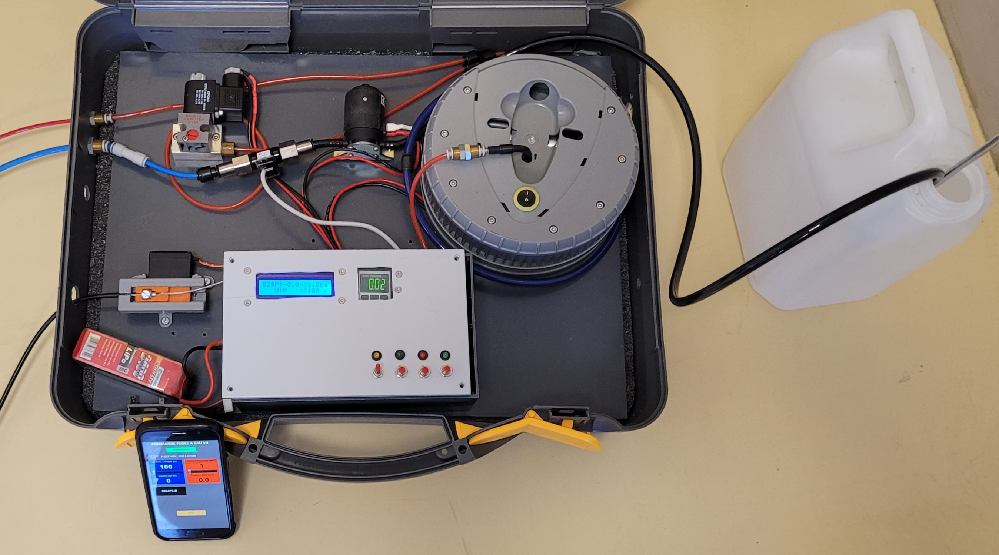
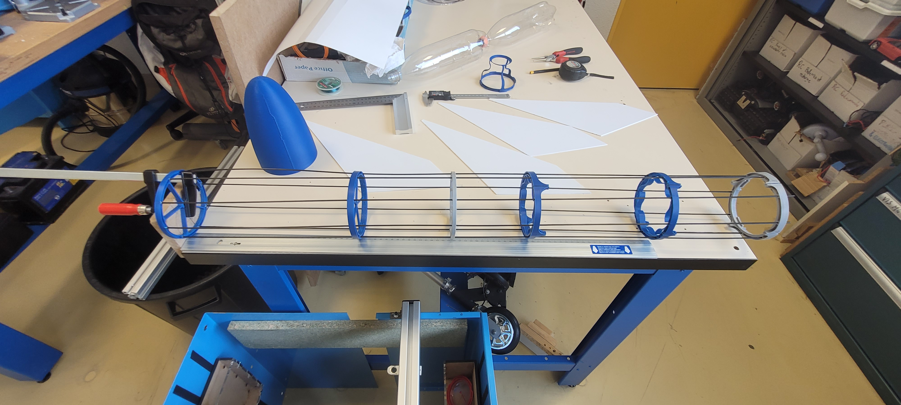

# FUSEE A EAUX

### 1- PROJET
Dans le cadre de la spécialité sciences de l’ingénieur, le projet consiste à suivre les différentes étapes d’ingénierie nécessaires pour la conception d’une fusée à eaux et des sa base de lancement optimisée pour répondre à un cahier des charges précis.

### 2- LE CAHIER DES CHARGES
Concevoir une fusée à propulsion à eau similaire aux fusées qui participent au concours [ROCKETRY CHALLENGE](https://www.planete-sciences.org/espace/Rocketry-Challenge/Presentation) organisé par planette science.
Dans ce concours, il s'agit de propulser un œuf de poule cru d’une masse comprise entre 55 et 61 grammes et d’un diamètre de 45 mm maximum (orientation libre). 
L’œuf doit revenir du vol sans aucune fissure ni dommage externe.
Les principaux éléments du règlement et du cahier des charges sont reproduits (et parfois simplifiés) dans le [cahier des charges fonctionnel](FUSEE%20A%20EAU_CDCF%20PROJET.pdf)

### 2 - MATERIEL :
Le système est décomposé en plusieurs sous ensembles :
- La RAMPE de lancement

- Le système de LARGAGE

 

- La VALISE d'automatisation

- la fusée à eau

 

### 3 - LES TESTS :
- Banc de TEST DE RESISTANCE à la pression

 

- Banc de TEST DE POUSSEE

  

- LES PREMIERS ESSAIS EN EXTERIEUR

  [Premier test](https://youtube.com/shorts/n9TUfji-JI4)
  
  [Largage au ralenti](https://youtube.com/shorts/VSt-5mvT0KY?feature=share)

### 4 - LES SIMULATIONS :

- Calcul du CX à partir d'une simulation aérodynamique

   

- Calcul de l'apogée théorique à partir de simulation Mécanique

  
